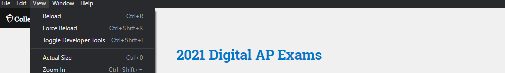
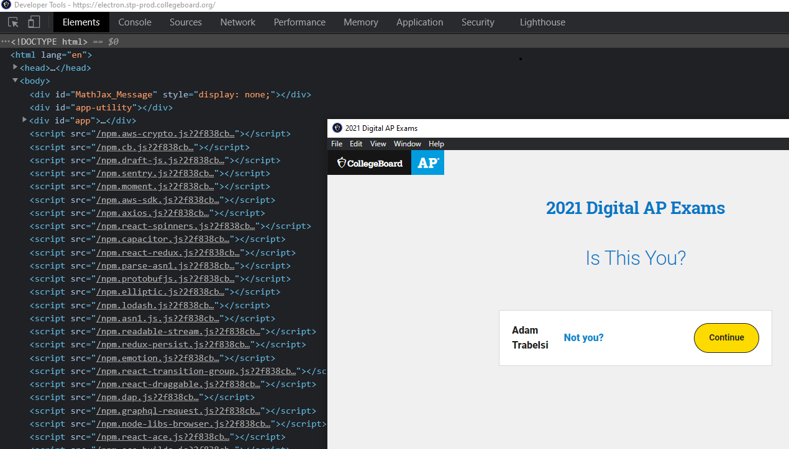
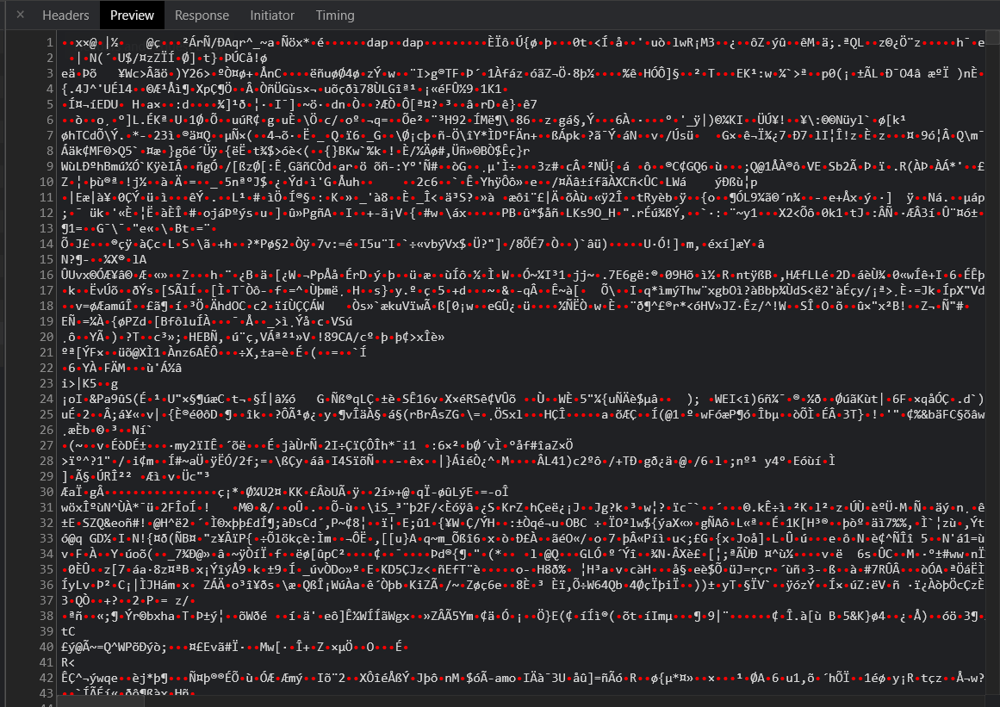

# Reverse Engineering a CollegeBoard App ft. Electron 
As I finished my last AP exam, I can dedicate myself to tinkering. I am going to uncover the technical inner-workings of the 2021 digital AP Exams App. 
> Some background info if you are lucky to evade the world of Standardized testing. The CollegeBoard is a company responsible for administrating international exams such as the SAT and AP exams which assist your admission into American universities and earn you college credit, respectively. 

My focus is the AP exams. Usually, they are given in large, vast rooms with strict security, but not this year. In 2021 students can take it on their small screens: laptops, desktops, and Chromebooks. The test, usually delivered on paper, is now administered online through an Electron app. 

### Electron 
Electron is a popular open-source framework that allows you to build cross-platform desktop apps. It powers VScode, Discord, and most importantly the AP Digital Exam app. The crucial aspect of Electron is that it is chromium based which grants me access to its powerful **DevTools**. If I can access DevTools, I can inspect the source DOM of the app. I can listen to its requests with the backend. I can gain insight. 

How are the test questions retrieved from CollegeBoard servers? Are they encrypted or plain JSON? How much personal data does the app send? What tech stack does the CollegeBoard use?

Those are all exciting questions to answer, but there is one bottleneck: I can not access the devtools. The devtools is blocked.

## Bypassing Devtools Blockage
In most electron apps, you can press the keybinding `ctr+shift+i` to summon DevTools. Try this in Discord! However, this approach failed in the digital test-taking app. *hmm, why?* I have never done any pentesting, but I know that the best approach to break something is to understand how to build it. The best approach to enable devtools is to understand how to disable them. 
 
I found a forum thread titled [ A way to prevent developer tools](https://discuss.atom.io/t/a-way-to-prevent-developer-tools/29746) which provided a collection of techniques to disable devtools; the most basic one was turning it off upon creating a new BrowserWindow Instance. `mainWindow = new BrowserWindow({ webPreferences:{devTools: false} })`
In order to bypass this. I have to truthify `devTools: false` 

### Digging into Source & app.asar    
The initialization of `BrowserWindow` is in the app's source code. I need to access that. Most Electron apps archive their source into `asar`, an archive format similar to tar. 

In order to extract src, I downaded `asar` package from npm and unpacked it through `asar extract %APPDATA%/cb-examn-player/recourcesapp.asar src` .

The src had the following file structure:
```
main
|__ index.js
node_modules
preload
splash
pacakge.json
``` 
The crucial part is index.js. A gigantic 3,000 kb file that contains all the electron side logic such as the CB lockdown browser and the blockage of `devtools`
 
Upon opening `index.js`, an upside-down jungle of code greeted me. The code was obfuscated. CB did this, proabably, to ward off users from accessing and reading the source code. Luckily there are ways to reverse obfuscate code, though it takes human resources and a sheer amount of patience. I have found [de4js](https://lelinhtinh.github.io/de4js/) to be the most effective javascript deobfuscator.
 
In the hunt for `BrowserWindow` calling location, there was a large array named `hax_0_0x177c`. It contained a string of most of the functions, objects, and parameters that the script uses. You might be asking yourself, why store function names in an array. Why complicate things. Well, that is the point of obfuscating code.

After two nights of looking for `BrowserWindow`, just when I thought I was gonna give up, I was pulled back in.  I found `BrowserWindow` calling location. Yes!!  

I trutified `devTools`. I Recompiled the app and hoped to explore its guts.  Unforntalty, I could not access DevTools through `ctrl shift i` because even though they are now enabled, the shortcut was disabled. I learned that for text security purposes, CB disabled most keybindings. 
Therefore, I had to either locate the `accelerator` that disabled the keybindings or improvise a different approach. I went with the latter option. I utilized Electron's Menu. 

### Reviving Electron Default Menu
I learned that the [default Electron menu](https://www.electronjs.org/docs/api/menu) has an inspect element button that opens DevTools. Currently, the collegeboard has disabled the menu, so I just had to hunt it down and revive it. After dealing with `BrowserWindow`, I picked up some tricks to deal with obfuscated code. This was not too hard. 

After some time, some electron documentation, and some stackoverflow, I found it. I enabled it. Then I opened it. Yes!!



Now that I have access to devtools, I can answer my questions.
## What Tech Stack Does the CollegeBoard use
Based on script tags, here is a list of client-side dependencies that the app uses:  
```
 aws-crypto.js
 cb.js
 draft-js.js
 sentry.js
 moment.js
 mathjax.js
 aws-sdk.js
 axios.js
 react-spinners.js
 capacitor.js
 react-redux.js
 parse-asn1.js
 protobufjs.js
 elliptic.js
 lodash.js
 asn1.js.js
 readable-stream.js
 redux-persist.js
 emotion.js
 react-transition-group.js
 react-draggable.js
 dap.js
 graphql-request.js
 node-libs-browser.js
 react-ace.js
 ace-builds.js
 react-dom.js
 immutable.js
 moment-timezone.js
 hotkeys-js.js
 bn.js.js
 buffer.js
 dexie.js
 diff-match-patch.js
 jmespath.js
 localforage.js
 lodash.isequal.js
 popper.js.js
 resize-observer-polyfill.js
 ua-parser-js.js
 ```

## What Private Information Does Collegeboard Collect?
 
CB uses, primarily, [sentry.io](sentry.io) to track users on test day. The reported data that the CB saves includes:

1. Breadcrumbs
Breadcrumbs record every interaction between the test taker and the app: clicks, inputs, and console. That means when you click the next button to move from a question to another, CB registers that event and stores it in a database somewhere. When you type your answer in the textbox, that event is also saved in CB databases. It is fair to note that not *what* you type is saved,  rather *where* you type. So CollegeBoard will not receive all your answer revisions, just the final one.  

2. Device Info
CollegeBoard records metadata on your device that ranges from your cpu manufacture to your disk type. Here is the full list:
- Memory/ RAM: 
    - free 
    - total  
- Operating System:
    - architecture 
    - CPU brand
    - CPU manufacture 
    - CPU model
    - distribution
    - virtual (detects wether your running vmware or other virtualization)
    - platform
    - release date
    - free and total storage
- Hard Drives: (detects how many disks you have)
    - disk type (ex: NTFS)
    - disk mount (ex: C:)
    - available bytes
    - disk size
    - disk used percentage
- Displays:
    - type of connection (VGA, HDMi, etc)
    - resolution
    - size   
- Process: (tracks all your open processes)

## how are test questions retrieved from CollegeBoard servers? 
I was intrigued by this question because the Collegeboard instructed all students to download the test three days before taking it. Does that mean the test in my position for three days? If so, I can open it and read the questions before test day. That is a security disaster. 
When I thought more about it, I theorized the test is probably downloaded in an encrypted format that only gets decrypted when the exam starts. This theory was true. 

Here is the data sent three days before taking one of my AP exams: 

It is encrypted. I did some digging to find out how it is secured. I found a job posting from CollegeBoard for electron engineers who are familiar with [AWS Key Management Service](https://docs.aws.amazon.com/kms/index.html). Assuming that that position was for this app, CB used AWS KMS to encrypt and decrypt the test. The inclusion of [`aws-crypto`](https://www.npmjs.com/package/@aws-crypto/client-node) as a client-side library solidifies this hypothesis. 

I did not try to decrypt or break the test because that would be cheating, which I strongly condemn. Regardless, it was a pleasure to wet my feet in cryptography, a field I hope to gain more knowledge on. 

## closing remarks
It is motivating to see familiar technologies like Axios, React, and GraphQl used in critical, real-world cases. Although dealing with obfuscated code was agony, I had quite some fun reverse engineering this app. Overall, this trip has taught me more about Electron and introduced me to cryptography. 