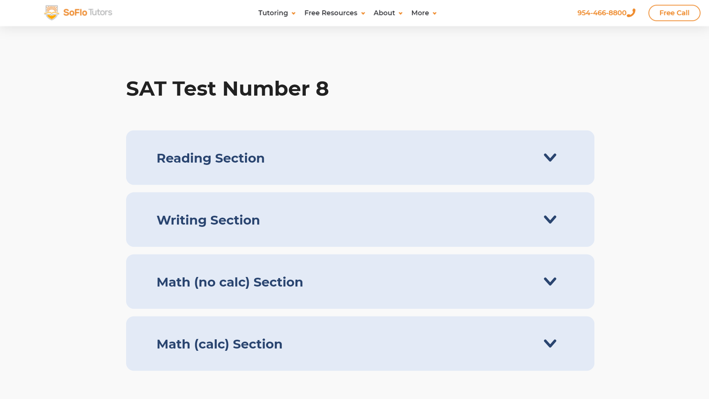
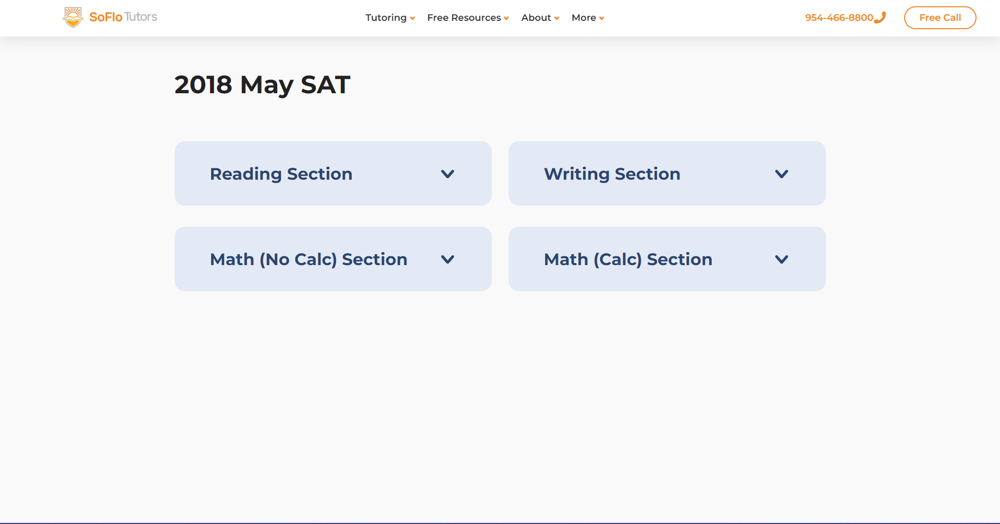
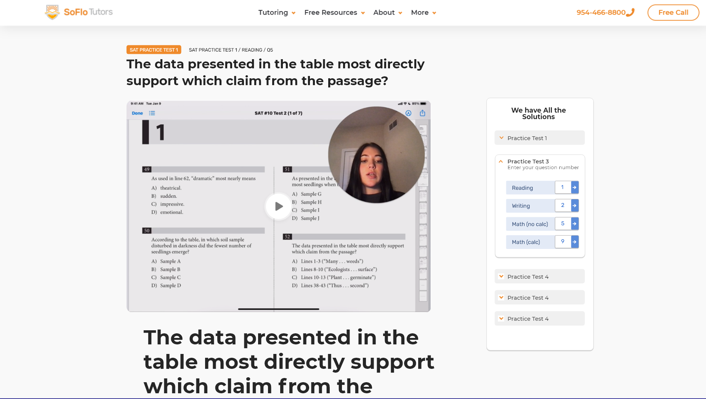
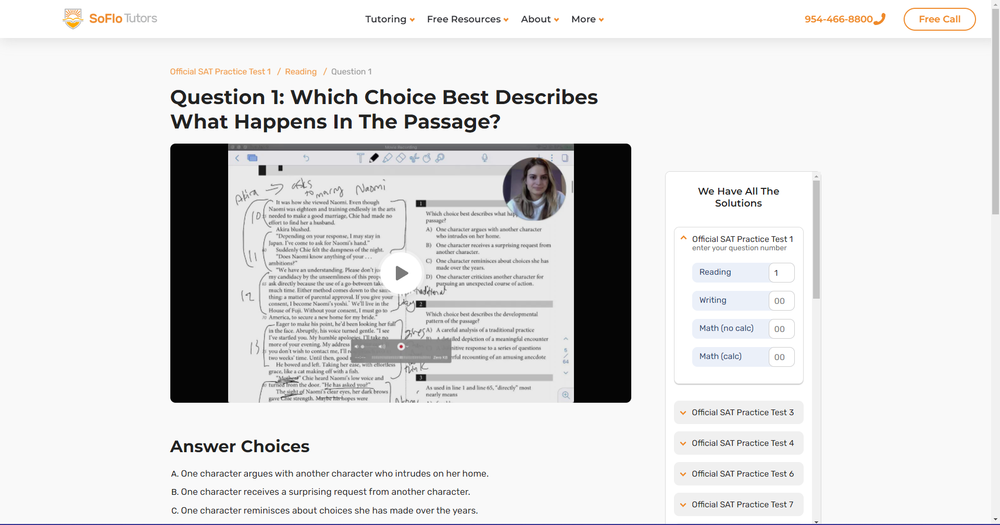

---	
slug: "soflo-explanations-hub"	
date: "2022-06-02"	
title: "Building the largest free SAT explanations hub"	
description: ""
status: "public"	
---	
# Building the largest free SAT explanations hub 

*this article is originally published at [soflotutors.com](https://soflotutors.com/blog/introducing-soflo-explanations-hub-the-largest-free-collection-of-sat-video-answer-explanations/). Written by me, and edited by a SoFlo Tutors editor. enjoy the read : )*

You took a practice SAT, and you finished self-grading it. You check out the answer key on the back of the test to understand your mistakes, only to be put down by confusing and cryptic paragraphs. The explanations for the answers don’t make sense. You then consult Google, trying to find scattered explanations from different websites. That’s too much work.

**Here at SoFlo Tutors, we’ve consolidated the scattered search by building a hub of question explanations**. Each SAT question has a thorough video that clearly and concisely explains the answer and the thought process behind the answer. **Currently, we have close to [3,000 SAT video explanations](https://soflotutors.com/explanations/official-sat-practice-test-1/reading/sat-official-1_s1_q2) for you to rely on.**

Three thousand questions to cover—that’s a huge number. Building such a vast platform was a technical road paved with problems, challenges, and corresponding solutions. If you’re curious about the platform’s building process, hop along for a quick technical overview. We’ll talk about choosing the appropriate tech stack, sourcing the data, structuring it, and building an engaging user interface.

## Loom and the 2684 Videos
Experienced tutors have already recorded the content for the 2684 questions on Loom, an excellent site for creating and sharing videos. We could’ve republished those videos on YouTube, but that would hinder the user experience. We wanted a custom-tailored hub that responds to the needs of the SAT student and only the SAT student—not grandmas looking for cat videos and uncles scouring for the game’s highlights. We wanted a hub that fits the student’s needs like a glove, and for that, we needed to build a platform from the ground up. We needed to support pagination between questions and easy navigation from section to section and test. We also needed good SEO optimization to expose our explanations to students who need them most. **The challenge was to use Loom’s videos as headless CMS and map each video to a page under SoFlo’s website.**

## React and Gatsby 
Since [soflotutors.com](https://soflotutors.com/) runs on WordPress, we first tried building the hub on our current tech, but we found ourselves fighting against the current. We tried using `<--nextpage-->` tag to implement pagination, but that didn’t satisfy our requirements as this pagination was simple and client-side. Each link wouldn’t have a unique page, which is unsatisfactory for SEO.

It was for the best. A new project deserves new tech. **We decided to go with React, the defacto choice to build a modern web app.**
Generally, when bootstrapping a react app, developers can go with three routes. Each one has pros and cons that align with different use cases:

1. Create React App, the basic choice for React: Quick and easy but horrible SEO optimization.
2. Gatsby.js: Excellent for SEO, ideal for static content.
3. Next.js: Excellent for SEO, ideal for dynamic content

Since SEO was a vital requirement, the choice was between Gatsby or Next. **The end product was mainly static because we didn’t have interactive data like user comments or likes, so employing a static generator was ideal**. Gatsby is a static site generator for React, while Next.js is a server-side react app that supports dynamic and fast-changing data (think the number of likes on a YouTube video and comments on an Instagram page). Therefore, we decided to give Gatsby the green light (no pun intended). We had a lot of experience with Gatsby before, too, so using it should be a smooth ride. Kinda.

Gatsby can be thought of as a grater. We feed the grater a block of your desired cheese, and it generates the desired texture like cheddar cheese. The block of cheese in this metaphor would be the raw content that we want to distribute to the user. This can be the text of blog posts or, in this case, video explanations (they will be served using a Loom iframe). We can then process the data and present it to the user in our needed format.

Gatsby uses Graphql to fetch and transform content from different sources and CMS: WordPress, contentful, markdown, CSV, JSON.

Loom doesn’t have native support on Gatsby, as transforming data from Loom to Gatsby is a rarely used case. **Therefore, we had to scrape Loom data and convert it to an extensive JSON flat-file database that Gatsby could read.**
## Scraping data
craping data is one of our lead developer [Adam Trabelsi](https://adtra.me)‘s favorite things to do.**There are usually two ways to go around doing it:**

1. Emulate a browser: Through selenium, puppeteer, and similar tools, you can automate the whole browser to simulate user interaction with a website. Along the way, save the data that you want.
	- Pros:
		- Relatively easy to build and set up.
	- Cons:
		- Hard to maintain as any change in UI and the HTML file structure might break the script.
		- Computationally expensive as running a browser can be demanding.
2. **Reverse engineer the internal API, then fetch that data natively.**
	- Pros:
		- Computationally inexpensive: Calling a server endpoint is way cheaper than emulating a whole browser.
		- Better for the long-term: Sites change their UI more than they change their APIs. Maintaining such a solution would require less effort.
	- Cons:
		- It can be sometimes tricky to set up: Reverse engineering APIs is, on occasions, mind-numbing.
		- It doesn’t work well with server-side rendered sites.

We didn’t need to save a lot of computational resources as the data scraping would not take place often. Loom, however, was a client-side app, and reverse engineering their API is more sustainable in the long-run. If we upload more videos in the features, the script won’t break as Loom changes its UI. Plus, using the API is more elegant.

Before long, we generated a file with structured data from Loom. Here is a sample:
```
[
	{
		name: "test name",
		slug: "test-name",
		sections: [
			{
				name: "Reading",
				slug: "test-name/reading",
				videos: [
					{
						name: "name of question",
						id: "id of the loom video",
						prettyName: "usually question prompt",
						answerChoicesArr: [],
						transcript: "transcript of the video"
					},
					{...}
				]
			},
			{...}
		]
	},
	{...},
]

```

### prettyName: a pretty complex problem of structuring unstructured data
The prettyName field included under each video is supposed to act as the h1 and the title for each post. In question answering sites like Chegg and Quizlet, the title is usually the question prompt. This way, the page will be easily discovered as the user types his query into google. Questions and prompts are essential. **The issue is that our videos didn't include the question prompt on Loom; therefore, we didn't have structured data about their content.** To solve this. We devised two solutions: a programmatic and a manual one. 

#### Manual Solution
we hired a small army of data clerks that added metadata to each loom video; that way, when it's fetched from gatsby, we know the question prompt. The metadata was written in a formatted way as a loom description. [More on that here](https://soflotutors.com/explanations/guidelines)

#### Programmatic Solution
Pragmatic solutions are fun as they’re usually more efficient, but we couldn’t deploy them for every practice test. We only used them on the official ones because the official SAT practice tests are the only tests that follow a structured format. They’re all text-based PDF websites, unlike the other practice tests, which are often scanned copies of real tests. Extracting data from messy PDFs would require an OCR and would diminish our ROI as hiring manual clerks is probably more efficient.

We converted the official PDFs into text and then ran a quick and dirty regex function that extracts the question prompt. Finding a consistent pattern was slightly tricky, but we got there.**We were also able to capture the answers along with the prompt. That is useful as it will give more context to the user down the road.**

Here’s the expression we ended up with: lots of lookaheads.

```
(^\d{1,2})
([\s\S]*?(?=A\)))([\s\S]*?(?=B\)))([\s\S]*?(?=C\)))([\s\S]*?(?=D\)))([\s\S]*?(?=^\d)) 
```


## Design
We now have the data and the tech stack. Before laying concrete on the ground, we started brainstorming the look and feel of the UI. We used Adobe XD. Since the developer, Adam Trabelsi, was responsible for both development and design, our xd files were proof of concepts more than a finished product. They were rough strokes.

**We improvised and made changes when coding out the designs. This approach may seem counterintuitive in large corporations, but it saves time and resources when the developer is also the designer.**

We will show you the designs vs. the finished product to showcase this roughness.
(../images/electron_default_menu.png)	
Design of Test Page: 


Actual Test Page:


Design of question page:



Actual question page:



## Building the front end with react
Unlike sourcing the data, the front end wasn’t that challenging. Most of the page is static except for:

- The accordion. We call it triple accordion because it has 3 levels: test -> section -> question.
- The transcript ‘continue reading’ functionality.
- The section dropdown found in the test and section page, which shows the questions under each section.

Building the triple accordion was a challenge as we were hesitant about how to show three levels of navigation under one component. In the end, though, it worked out.**With the feedback from others at SoFlo, we produced an easy-to-use utility that can take the student from one question to another without much thought**. We added some animation in the end, using `framer-motion` to spice things up.

Another quirky UI detail is the section dropdown component. It has a cool hover animation and a responsive cell size based on the number of questions the post covered. Some of the posts cover two questions at the same time. To account for that, the cell housing for that post expands n times the number of questions. [See the variable cell sizes here](https://soflotutors.com/explanations/official-sat-practice-test-1/reading).


## Final Thoughts

This was one of the most challenging projects we launched and completed. There were multiple road maps and private consultants told us that our requirements were not achievable, but thanks to a great lead developer, we have launched [free SAT video explanations](https://soflotutors.com/explanations) that are beginning to drive traffic to our website and will be a great resource to student studying for the SAT.